# 📝 Fluxo de Perguntas para Commit

Este documento mostra o fluxo completo de perguntas que o hook `prepare-commit-msg` faz durante um commit.

## 🎯 Diagrama do Fluxo Completo

```mermaid
flowchart TD
    Start([🚀 git commit]) --> AnaliseArquivos[📂 ANÁLISE DE ARQUIVOS]
    
    AnaliseArquivos --> ListaArquivos[📋 Lista arquivos em stage<br/>com tamanhos e status]
    ListaArquivos --> VerificaBloqueados{Arquivos > 100MB?}
    
    VerificaBloqueados -->|Sim| ErroBloquear[❌ ERRO: Arquivo muito grande<br/>Sugestões: Git LFS, .gitignore, split]
    ErroBloquear --> FimErro([❌ Commit cancelado])
    
    VerificaBloqueados -->|Não| OfereceGitLFS{Arquivos > 50MB?}
    OfereceGitLFS -->|Sim| PerguntaLFS[⚙️ Configurar Git LFS?]
    PerguntaLFS --> SelecaoArquivos
    OfereceGitLFS -->|Não| SelecaoArquivos
    
    SelecaoArquivos[✅ SELEÇÃO DE ARQUIVOS<br/>Digite: t=todos, n=nenhum, 1,2,3=números]
    SelecaoArquivos --> ValidacaoTecnica
    
    ValidacaoTecnica[🔍 VALIDAÇÕES TÉCNICAS] --> ValidaCSV{Tem CSV?}
    ValidaCSV -->|Sim| CheckCSV[✓ Separador ';'<br/>✓ UTF-8<br/>✓ Cabeçalho sem acentos<br/>✓ snake_case]
    CheckCSV --> ValidaMD
    ValidaCSV -->|Não| ValidaMD
    
    ValidaMD{Tem Markdown?} -->|Sim| CheckMD[✓ Títulos com espaço '# Título'<br/>✓ Tabelas com separador]
    CheckMD --> ModoRapido
    ValidaMD -->|Não| ModoRapido
    
    ModoRapido{≤ 3 arquivos?} -->|Sim| PerguntaModoRapido[⚡ Usar modo rápido?]
    PerguntaModoRapido -->|Sim| FluxoRapido[MODO RÁPIDO<br/>Apenas tipo + resumo]
    FluxoRapido --> RevisaoFinal
    
    PerguntaModoRapido -->|Não| Backup
    ModoRapido -->|Não| Backup
    
    Backup[💾 Criar backup automático] --> TipoCommit
    
    TipoCommit[📌 PASSO 1/4: TIPO DE COMMIT<br/>Escolha o número:]
    TipoCommit --> OpTipo["1. dados: Adicionar/atualizar em data/<br/>2. limpeza: Scripts em data/2-clean/<br/>3. script: Scripts em scripts/<br/>4. docs: Arquivos .md<br/>5. fix: Correção de erros<br/>6. entrega: Mover para data/3-delivery/<br/>7. feat: Nova funcionalidade"]
    
    OpTipo --> IDTarefa[🆔 PASSO 2/4: ID DA TAREFA opcional<br/>Ex: DP-012, BU-001]
    IDTarefa --> Escopo[📂 PASSO 3/4: ESCOPO opcional<br/>Ex: dados, pipeline, api]
    Escopo --> Resumo[📝 PASSO 4/4: RESUMO obrigatório<br/>Máx 72 caracteres<br/>Presente: 'Adiciona', 'Corrige']
    
    Resumo --> CorpoOpcional{Adicionar<br/>corpo detalhado?}
    CorpoOpcional -->|Sim| CorpoTexto[🔬 CORPO DO COMMIT<br/>Digite múltiplas linhas<br/>Digite 'FIM' para finalizar]
    CorpoTexto --> RevisaoFinal
    CorpoOpcional -->|Não| RevisaoFinal
    
    RevisaoFinal[✨ REVISÃO FINAL<br/>Mostra mensagem montada]
    RevisaoFinal --> RevisarManual{Revisar manualmente?}
    
    RevisarManual -->|Sim| AbreEditor[📝 Abre editor Git<br/>Permite ajustes]
    AbreEditor --> FimSucesso
    RevisarManual -->|Não| UsaMensagem[✅ Usa mensagem gerada]
    UsaMensagem --> FimSucesso
    
    FimSucesso([🎉 Commit criado com sucesso!])
    
    style Start fill:#4CAF50
    style FimSucesso fill:#4CAF50
    style FimErro fill:#f44336
    style TipoCommit fill:#2196F3
    style IDTarefa fill:#2196F3
    style Escopo fill:#2196F3
    style Resumo fill:#2196F3
    style RevisaoFinal fill:#FF9800
```



## 📊 Detalhamento das Perguntas

### 1️⃣ **Tipo de Commit** (Obrigatório)

**Pergunta:** "Tipos disponíveis (Convenção do Angular):"

**Opções:**
1. `dados` - Adicionar ou atualizar ficheiros em data/
2. `limpeza` - Scripts ou alterações em data/2-clean/
3. `script` - Adicionar ou modificar scripts em scripts/
4. `docs` - Alterações em arquivos .md
5. `fix` - Correção de erros
6. `entrega` - Mover ficheiros para data/3-delivery/
7. `feat` - Nova funcionalidade ou melhoria

**Exemplo de saída:** `dados`

---

### 2️⃣ **ID da Tarefa** (Opcional)

**Pergunta:** "Digite o ID (ou ENTER para pular):"

**Formato esperado:**
- Código CRISP-DM: `DP-012`, `BU-001`, `DU-005`
- Issues do GitHub: `#15`, `#42`
- Projeto: `PROJ-42`, `TL-100`

**Exemplo de saída:** `DP-012`

---

### 3️⃣ **Escopo** (Opcional)

**Pergunta:** "Digite o escopo (ou ENTER para pular):"

**Exemplos:**
- `dados` - mudanças em diretório data/
- `pipeline` - pipeline de processamento
- `api` - backend/API
- `auth` - autenticação
- `database` - banco de dados

**Exemplo de saída:** `pipeline`

---

### 4️⃣ **Resumo** (Obrigatório)

**Pergunta:** "Digite o resumo:"

**Regras:**
- ✅ Máximo 72 caracteres
- ✅ Verbo no presente: "Adiciona", "Corrige", "Remove"
- ✅ Seja específico: diga O QUE, não COMO
- ❌ Evite: "Atualizações no código" (muito vago)

**Exemplos bons:**
- ✅ "Adiciona validação de dados no pipeline"
- ✅ "Corrige encoding na leitura de CSV"
- ✅ "Remove dependência obsoleta do pandas"

**Exemplo de saída:** `Adiciona dataset INE população 2024`

---

### 5️⃣ **Corpo** (Opcional)

**Pergunta:** "Digite o corpo (várias linhas). Digite 'FIM' para finalizar."

**O que incluir:**
- 📌 O problema que estava resolvendo
- 📌 A abordagem que usou
- 📌 Alternativas consideradas
- 📌 Impacto esperado

**Exemplo:**
```
Este dataset contém dados populacionais por município
para análise de imigração. Fonte: INE Portugal.

Os dados foram baixados em formato Excel e convertidos
para CSV com separador ';' e encoding UTF-8.
FIM
```

---

### 6️⃣ **Revisão Final**

**Mensagem montada:**
```
dados(pipeline): Adiciona dataset INE população 2024

Este dataset contém dados populacionais por município
para análise de imigração. Fonte: INE Portugal.

Os dados foram baixados em formato Excel e convertidos
para CSV com separador ';' e encoding UTF-8.
```

**Pergunta:** "Deseja revisar manualmente antes de commit? (s/n):"
- `s` → Abre editor Git para ajustes
- `n` → Usa a mensagem como está

---

## ⚡ Modo Rápido

Ativado automaticamente se:
- ≤ 3 arquivos em stage
- Usuário aceita modo rápido

**Perguntas simplificadas:**
1. Tipo de commit (1-7)
2. Resumo (string)
3. Adicionar corpo? (s/n)

**Pula:**
- ❌ ID da tarefa
- ❌ Escopo
- ❌ Perguntas detalhadas do corpo

---

## 🔍 Validações Automáticas

### CSV
- ✅ Separador `;` (ponto e vírgula)
- ✅ Encoding UTF-8
- ✅ Cabeçalho sem acentos
- ✅ Nomes de colunas em snake_case (minúsculas)

### Markdown
- ✅ Títulos com espaço: `# Título` não `#Título`
- ✅ Tabelas com linha separadora `|---|`

### Arquivos
- ⚠️ Aviso se > 50MB
- ❌ Bloqueio se > 100MB
- 💡 Sugere Git LFS para arquivos grandes

---

## 🎯 Resultado Final

**Formato da mensagem:**
```
tipo(escopo): resumo curto

Corpo opcional com múltiplas linhas
explicando o contexto e motivação da mudança.

Pode incluir vários parágrafos.
```

**Exemplo real:**
```
dados(pipeline): Adiciona dataset INE população 2024

Este dataset contém dados populacionais por município
para análise de imigração. Fonte: INE Portugal.

Os dados foram baixados em formato Excel e convertidos
para CSV com separador ';' e encoding UTF-8.
```
