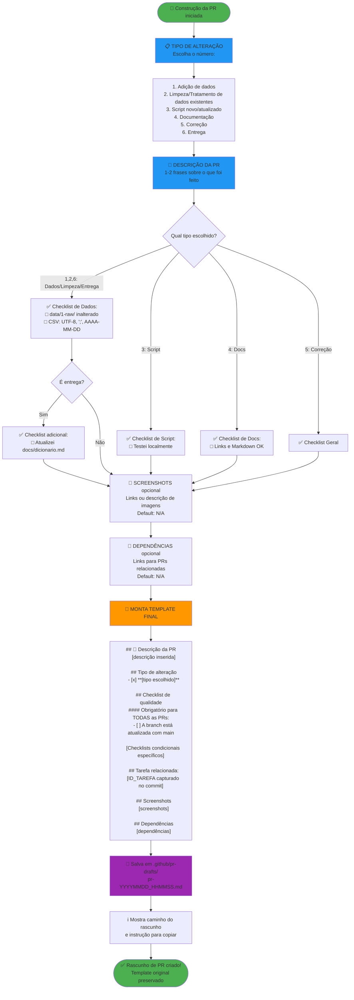
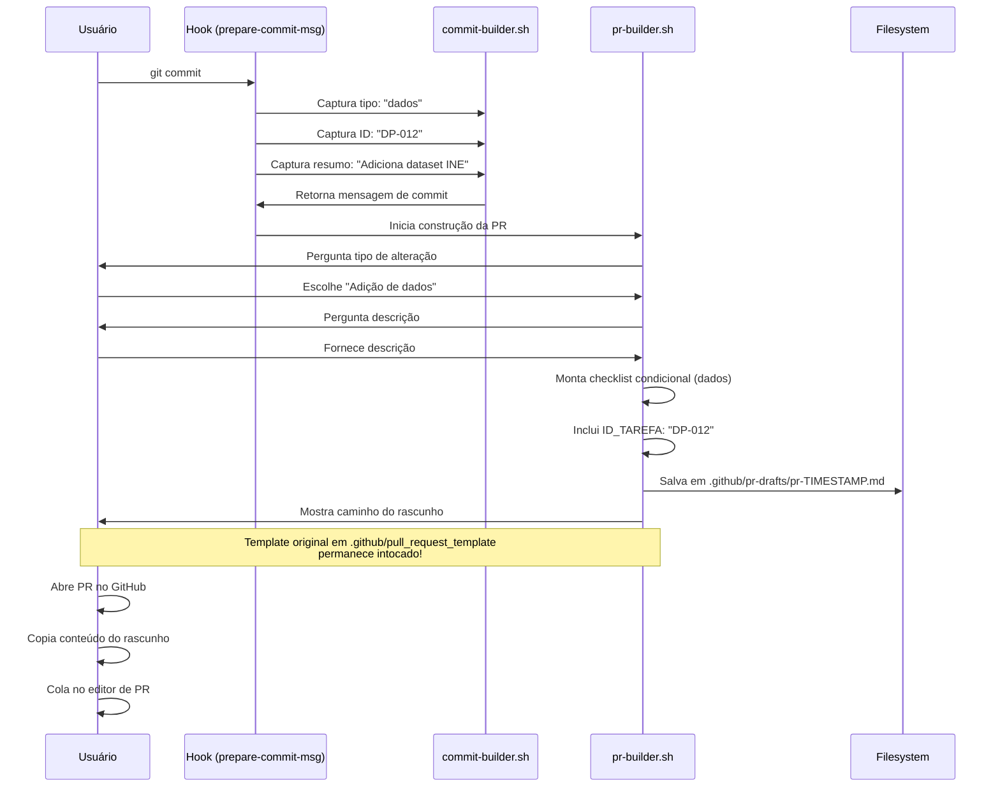

# 📋 Fluxo de Perguntas para Pull Request

Este documento mostra o fluxo de construção do template de Pull Request durante o commit.

## 🎯 Diagrama do Fluxo da PR



## 📊 Detalhamento das Perguntas

### 1️⃣ **Tipo de Alteração** (Obrigatório)

**Pergunta:** "Tipo de mudança:"

**Opções (alinhadas com CONTRIBUTING.md):**
1. **Adição de dados** - Adicionar novos datasets
2. **Limpeza/Tratamento de dados existentes** - Processar dados em data/2-clean/
3. **Script novo/atualizado** - Criar ou modificar scripts
4. **Documentação** - Mudanças em docs, reports, README
5. **Correção** - Ajuste pontual em dados ou script
6. **Entrega** - Movendo arquivos para data/3-delivery/

**Exemplo de saída:** `Adição de dados`

---

### 2️⃣ **Descrição da PR** (Opcional)

**Pergunta:** "Digite a descrição (ou ENTER para pular):"

**O que incluir:**
- Contexto da mudança
- Motivação
- Pense em quem vai revisar

**Exemplo:**
```
Esta PR adiciona o dataset de população do INE para análise
de padrões migratórios em Portugal no período 2020-2024.
```

---

### 3️⃣ **Checklists Condicionais** (Automático)

O sistema monta checklists **automaticamente** baseado no tipo escolhido:

#### 📊 Para: Adição de dados, Limpeza, Entrega

```markdown
#### Aplicável apenas para **dados** (CSV, Excel, etc.):
- [ ] Os arquivos em `data/1-raw/` permanecem **inalterados**
- [ ] O CSV segue o padrão: UTF-8, separador `;`, datas `AAAA-MM-DD`
```

**Se for Entrega, adiciona:**
```markdown
#### Aplicável apenas para **dados que vão para `delivery/`**:
- [ ] Atualizei `docs/dicionario.md`
```

#### 💻 Para: Script novo/atualizado

```markdown
#### Aplicável apenas para **scripts**:
- [ ] Testei localmente o funcionamento do script
```

#### 📝 Para: Documentação

```markdown
#### Aplicável apenas para **documentação**:
- [ ] Verifiquei links e formatação Markdown
```

#### 🔧 Para: Correção

Usa apenas checklist geral (branch atualizada).

---

### 4️⃣ **Screenshots** (Opcional)

**Pergunta:** "Digite a descrição (ou ENTER):"

**O que incluir:**
- Links para imagens (hospedadas no GitHub, Imgur, etc.)
- Descrição breve se não houver imagens
- Digite N/A se não aplicável

**Exemplo:**
```


Gráfico mostra distribuição populacional por região.
```

---

### 5️⃣ **Dependências** (Opcional)

**Pergunta:** "Digite (ou ENTER):"

**O que incluir:**
- Links para outras PRs que devem ser mergeadas primeiro
- Issues relacionadas
- N/A se não houver

**Exemplo:**
```
https://github.com/equipe-tratadados/estagio-prepara-portugal/pull/42
```

---

## 📄 Template Final Gerado

### Exemplo Completo

```markdown
## 📌 Descrição da PR
<!-- Descreve em 1-2 frases o que foi feito -->

Esta PR adiciona o dataset de população do INE para análise
de padrões migratórios em Portugal no período 2020-2024.

## Tipo de alteração
- [x] **Adição de dados**

## Checklist de qualidade

#### Obrigatório para TODAS as PRs:
- [ ] A branch está atualizada com `main`

#### Aplicável apenas para **dados** (CSV, Excel, etc.):
- [ ] Os arquivos em `data/1-raw/` permanecem **inalterados**
- [ ] O CSV segue o padrão: UTF-8, separador `;`, datas `AAAA-MM-DD`

## Tarefa relacionada:
DP-012

## Screenshots (se aplicável)


## Dependências
https://github.com/equipe-tratadados/estagio-prepara-portugal/pull/41
```

---

## 💾 Onde o Template é Salvo

### Localização
```
.github/pr-drafts/pr-20260630_184500.md
```

### Por que Rascunho?
- ✅ **NÃO sobrescreve** `.github/pull_request_template` do projeto
- ✅ Mantém template original intocado
- ✅ Gera timestamp único
- ✅ Fácil de copiar quando abrir PR no GitHub

### Mensagem Mostrada
```
✅ Rascunho da PR salvo em: .github/pr-drafts/pr-20260630_184500.md
ℹ️  Copie este conteúdo ao abrir a PR no GitHub!
ℹ️  O template padrão em .github/pull_request_template será preenchido automaticamente
```

---

## 🔄 Integração com Git Commit

O template de PR é construído **durante o commit** usando dados capturados:

### Dados Reutilizados

| De onde vem | O que captura | Onde usa na PR |
|-------------|---------------|----------------|
| `perguntar_tipo()` | Tipo de commit (dados, script, etc.) | Sugere tipo similar na PR |
| `perguntar_id_tarefa()` | ID da tarefa (DP-012) | Campo "Tarefa relacionada" |
| `perguntar_resumo()` | Resumo do commit | Pode sugerir descrição |
| Análise de arquivos | Tipo de arquivos modificados | Determina checklist condicional |

---

## 📋 Comparação: Template do Projeto vs Template Gerado

### Template Original (Preservado)
```
.github/pull_request_template
```
- ✅ Mantém formato definido pela equipe
- ✅ Usado automaticamente pelo GitHub
- ✅ Nunca é modificado pelos hooks

### Template Gerado (Rascunho)
```
.github/pr-drafts/pr-YYYYMMDD_HHMMSS.md
```
- ✅ Pré-preenchido com dados do commit
- ✅ Checklists condicionais baseados no tipo
- ✅ Inclui ID da tarefa automaticamente
- ✅ Usuário copia conteúdo ao abrir PR

---

## 🎯 Fluxo Completo: Commit → PR



---

## ✅ Melhores Práticas

### Ao Criar uma PR

1. ✅ **Use o rascunho gerado** - Já vem pré-preenchido
2. ✅ **Revise os checklists** - Marque apenas o que se aplica
3. ✅ **Adicione screenshots** - Se mudanças visuais
4. ✅ **Referencie tarefas** - ID já está incluído
5. ✅ **Mantenha < 400 linhas** - Facilita revisão

### Para Revisores

1. ✅ **Verifique checklists** - Todos marcados?
2. ✅ **Valide arquivos de dados** - data/1-raw/ intocado?
3. ✅ **Teste scripts** - Se aplicável
4. ✅ **Revise documentação** - Links funcionam?
5. ✅ **Aprove ou solicite mudanças** - Feedback construtivo

---

## 🚀 Resultado Final

Ao final do processo:

- ✅ Commit criado com mensagem estruturada
- ✅ Rascunho de PR gerado automatically
- ✅ Template do projeto preservado
- ✅ Checklists relevantes incluídos
- ✅ ID da tarefa propagado
- ✅ Pronto para abrir PR no GitHub! 🎉
